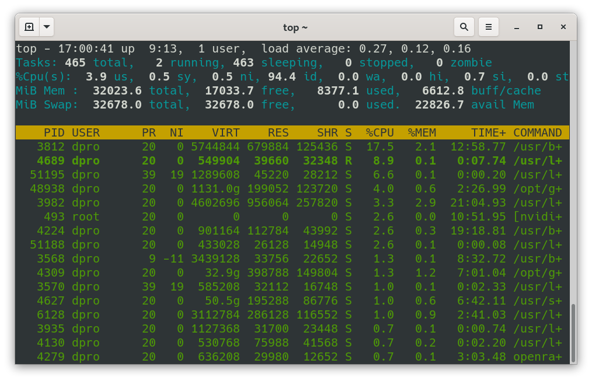

# Lab 31 - Processes ⚙️

Processes are what makes the Linux world go 'round. In this lab we'll:

- View processes with the `ps` command and `top`
- Terminate processes with Linux commands
- End processes within `top`

> Note: For this lab I'll be working on a Debian client as the `user` account.

## View Process with `ps` and `top`

You can use the `ps` command and the `top` program/command to analyze the processes that are running in Linux. Are these the only two ways to do this in Linux? Of course not, but they are two commonly used methods. Let's show both of them.

### View Processes with the `ps` command

The `ps` command reports a snapshot of the current process.

By itself, `ps` doesn't do much. It simply shows the shell process that is running and the `ps` process. (Handy command to find out the shell quickly though!)

Let's show some more examples of `ps`.

- Display all processes currently running:

  `ps -e`

  By default, this command shows each process, listed by process ID. It also shows the time that each process has been running and the process name (CMD).

- For more detailed information use the `-ef` options:

  `ps -ef`

- For even more detailed info (with a bit of a different look), try the `-aux` options:

  `ps -aux` or `ps -auxc`

The main problem with these last three commands is that they offer up a bit too much information.

Let's filter the results.

- Open Firefox
- Run the command: `ps -e | grep "firefox"`
- View the results. They should look similar to the following:
  
  `5202 ?      00:00:26 firefox-esr`

  So the `-e` option shows the actual process that underlies the Firefox web browser program. if we needed to terminate the program we would do so by calling on the PID 5202 that is listed.  

  However, the Firefox program will initiate several other processes.
  
- Use the following command to filter for all Firefox processes:

  `ps -aux | grep "firefox"`

  No you should see several processes running which are all based on the original process ID that was displayed with the previous command.

  > Note: Are the double-quotes necessary? Not in this case, but if you have more advanced searches an/or spaces in the name, you should use the double-quotes.

### View Processes with `top`

To run top, simply open a terminal and type `top`. It will display results that are similar to the figure below:

In this figure, we see that top is broken into two sections:

- System Summary: This is above the yellow header. It currently contains five rows of information including CPU, RAM, and tasks. More on this section later.
- List of processes: This is the yellow header and below. We'll focus on this to start.

In the figure, I am working as the dpro user account. You can see the process ID (PID) as well as the CPU and memory usage for each process, as well as the process (COMMAND) at the end.

Try running `top` on your Linux system now.

You will find that a lot of information is displayed to you. Let's filter it out:

- Open the Firefox web browser (if it is not opened already)
- Press `O`
- Type the following: `COMMAND=firefox`

That should filter everything else out and display the `firefox-esr` process only. This makes it a lot easier to troubleshoot programs.

- When you are done looking at that process, press the `=` key to remove the filter.

Try another one:

- Open the "Files" program. (this requires the Gnome desktop.)
- Go back to the terminal and `top` program.
- Press `O`
- Type: `COMMAND=nautilus`

That should display the `nautilus` process, which is the underlying process for the Files program.

- Press `=` to remove the filter.

There you go. Now you can analyze your system with the `top` program!

> Note: You might also be interested in derivatives of `top` including `htop`, `btop` and `bottom`. Lots of fun!

## Terminate Processes with Linux Commands

There are a variety of ways to terminate processes: commands, top, keyboard shortcuts, the list goes on. Let's show a couple of commands that you can use.

### kill

Sounds gruesome, but in computer technology, "kill" is the equivalent of "terminate", and which would you rather type? Let's show how to use this command.

- Open the Calculator program (known as `gnome-calculator`).
- View the process: `ps aux | grep calc`
- Locate the PID for `gnome-calculator`
- End the process `kill <PID_NUMBER>`

Did the Calculator program end? It should have. Easy!

This is a fantastic way to terminate non-responsive programs that could be causing system performance degradation or conflicts.

### pkill

`pkill` can be used in concert with `pgrep` to quickly list and terminate all processes related to a single type of program (or group of programs). For example:

- Open Firefox
- Now, open two more Firefox windows by right-clicking the icon and selecting "New Window".
- Type `ps -aux | grep "firefox"`. You will see a lot of information. Let's narrow it down:
- `pgrep "firefox"`. This should only show the most important PIDs you need.
- Now terminate: `pkill "firefox"`

That will terminate all instances of firefox. Prove it with another `ps aux | grep "firefox"` command or `pgrep "firefox"`

> Note: You might remember using this command during the SSH portion of this course. I rely on it heavily in that respect.

This can also be used to terminate all processes based on a name. For example:

> **WARNING!** Careful with this one! It will close all terminals that are opened!

`pkill gnome-terminal`

Yikes!

### killall (optional)

The `killall` command is not installed by default. But you can get it with the following command:

`sudo apt install psmisc`

This can also be used to terminate all processes based on a name. For example, open two instances of the Calculator. Then:

`killall gnome-calculator`

That should terminate both instances at once. There is a bit more functionality with this command. Check out `killall -h`

### Stop and Terminate Active Processes with Keyboard Shortcuts

Try this:

`ping example.com`

In Linux the results will keep piling in. Want to terminate the process? You could do it from another terminal, but why? Use the `Ctrl + C` keboard shortcut. That will signal the system to kill the active process.

Or, perhaps you want to *stop* the process and leave it running in the background? This will allow you to access it later.

Example:

- Type `ping example.com`
- Press `Ctrl + Z`
- Note the difference here. When you press `Ctrl + Z` it says "Stopped", whereas the `Ctrl +C` shortcut did not.
- Now type `fg` (short for foreground). This should start up the latest process that you initiated in the terminal, in this case, the ping.
- Now, terminate the process altogether: `Ctrl + C`.
- If you type `fg` now, you will see there is no job to run in the foreground.

> Note: By default `fg` command will remember the latest stopped job in that particular terminal and run it in the foreground (where you can see it), or you can run them in the *background* with the `bg` command.

## End Processes within `top`

I primarily use top to analyze the system and terminate processes that are not behaving.

For example, let's say that a web browser freezes up. So we open up top and view the processes. Chances are that the web browser will be listed first, and it will be hovering somewhere around 100% CPU usage. Then, it's just a matter of stopping that process. Easily done!

- Press the k key. ("k" for "kill", the less pleasant synonym of "terminate"). By default, it will list the PID that is the highest on the list.
- To terminate the listed PID, simply press enter. If you need to terminate another PID, type in that number and then press enter.
- Press enter to terminate the process in the default manner. Or, choose the type of signal to send to the PID. By default, it is the #15 signal, called SIGTERM, which is used to signal the standard termination of the process. It attempts to do so in a graceful way but can be blocked or handled by other processes. 

> Note: If 15 doesn't work, the next option is to use signal 9 (SIGKILL), which ends the process immediately, without any interaction. Careful with that, it is an ungraceful termination (a true "kill") and could cause other issues in the system.

**REMEMBER!** In the case that you cannot find the process within the top list, you can filter for it by pressing `o` and then typing `COMMAND=<process_name>`. So for example, if I wanted to filter for the Firefox browser I would press `o` and then type `COMMAND=firefox-esr`. (You could even abbreviate it, for example `fire`.) That should now show only the Firefox process. This way it is easier to focus on and analyze a single process. When you're done, press `=` to clear all filters.

👍 **Top That!** 👍

---

## 📃 Extra Credit

Learn more about the `ps` command and `top`:

`man ps`

`man top`

Check out my in-depth article/video about `top` on my website at [this link.](https://prowse.tech/top/)

---
